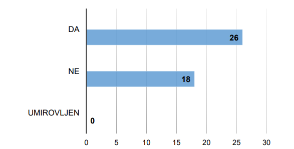
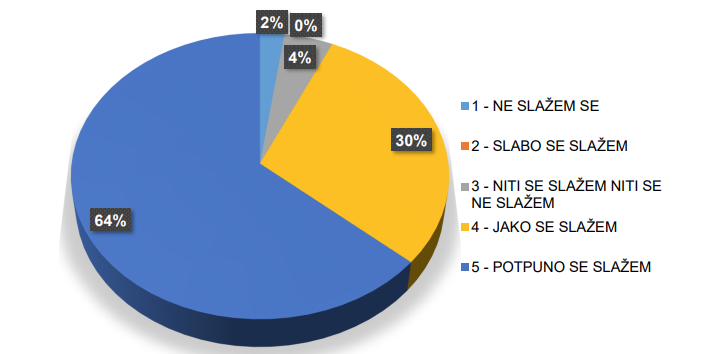
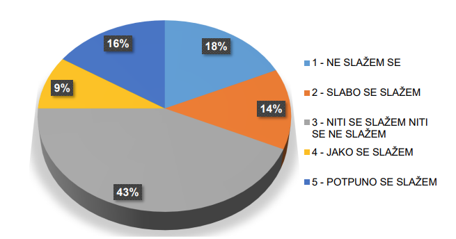
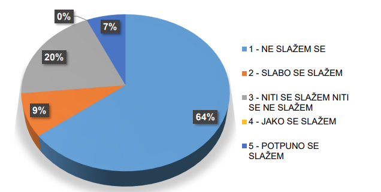
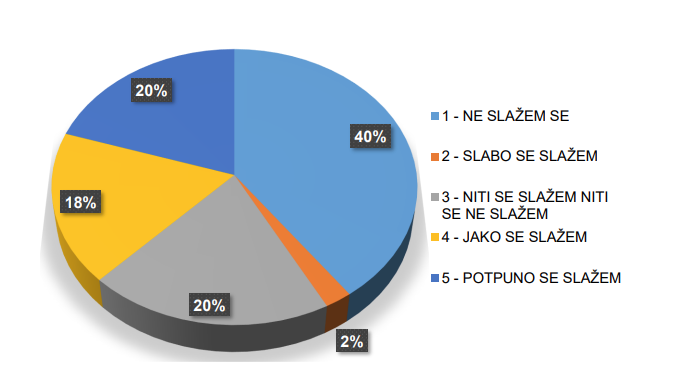
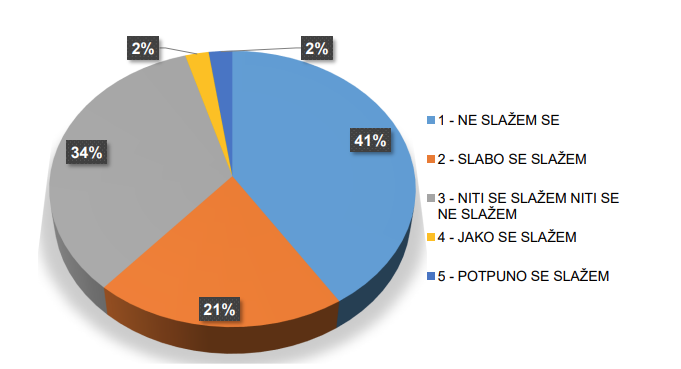

# LV12 - Mrežno sjedište

---
#### [index.html](https://joska.vercel.app/repo%20-%20sadr%C5%BEaj/3.%20razred/SJWP/LV12%20-%20html/index.html)
---

## Struktura projekta
LV12 - HTML/
├── index.html
├── results.html
├── author.html
├── css/
│   └── styles.css
└── images/
    ├── graph1.png
    ├── graph2.png
    ├── graph3.png
    ├── graph4.png
    ├── graph5.png
    ├── graph6.png
    ├── graph7.png
    ├── graph8.png
    ├── graph9.png
    ├── graph10.png
    ├── graph11.png
    ├── graph12.png
    ├── graph13.png
    └── graph14.png

## Opis strukture

- `index.html` - Početna stranica s osnovnim informacijama i hipotezama
- `results.html` - Stranica s rezultatima istraživanja / grafovima i zaključcima
- `author.html` - Stranica s informacijama o autoru
- `css/styles.css` - Stilovi za sve stranice
- `images/` - Mapa sa svim grafovima korištenim u prikazu rezultata


### index.html
```html
<!DOCTYPE html>
<html lang="hr">

<head>
    <meta charset="UTF-8">
    <meta name="viewport" content="width=device-width, initial-scale=1.0">
    <title>Psihološke cijene - Istraživanje</title>
    <link rel="stylesheet" href="css/styles.css">
</head>

<body>
    <header class="hero">
        <div class="container">
            <h1>Istraživanje utjecaja psiholoških cijena</h1>
            <p class="hero-subtitle">Analiza ponašanja potrošača i njihove reakcije na takozvane "psihološke cijene"</p>
            <nav class="main-nav">
                <ul>
                    <li><a href="index.html" class="active">Početna</a></li>
                    <li><a href="results.html">Rezultati</a></li>
                    <li><a href="author.html">O autoru</a></li>
                </ul>
            </nav>
        </div>
    </header>

    <main class="container">
        <div class="grid-layout">
            <section class="info-card">
                <h2>O istraživanju</h2>
                <div class="stat-grid">
                    <div class="stat-item">
                        <span class="stat-number">45</span>
                        <span class="stat-label">Ispitanika</span>
                    </div>
                    <div class="stat-item">
                        <span class="stat-number">14</span>
                        <span class="stat-label">Pitanja</span>
                    </div>
                    <div class="stat-item">
                        <span class="stat-number">3</span>
                        <span class="stat-label">Hipoteze</span>
                    </div>
                </div>
            </section>

            <section class="hypotheses-card">
                <h2>Hipoteze istraživanja</h2>
                <div class="hypothesis-list">
                    <div class="hypothesis-item">
                        <span class="hypothesis-label">H0</span>
                        <p>Cijene snažno utječu na ponašanje potrošača i njihove odluke o kupnji.</p>
                    </div>
                    <div class="hypothesis-item">
                        <span class="hypothesis-label">H1</span>
                        <p>Psihološke cijene imaju utjecaj na ponašanje potrošača, no njemu su izloženiji
                            iracionalni potrošači.</p>
                    </div>
                    <div class="hypothesis-item">
                        <span class="hypothesis-label">H2</span>
                        <p>Kod racionalnih potršača psihološke cijene mogu izazvati suprotne efekte poput
                            percepcije o nižoj kvaliteti proizvoda.</p>
                    </div>
                </div>
            </section>

            <section class="methodology-card">
                <h2>Metodologija</h2>
                <p>Istraživanje je provedeno putem ankete koja je sadržavala kombinaciju demografskih pitanja i
                    specifičnih pitanja o percepciji psiholoških cijena. Fokus je bio na razumijevanju kako različite
                    skupine potrošača reagiraju na cijene koje završavaju sa 9.</p>
            </section>
        </div>

        <footer class="page-footer">
            <p>Mrežnu stranicu napravio: <strong>Niko Josipović</strong></p>
        </footer>
    </main>
</body>

</html>
```

### results.html
```html
<!DOCTYPE html>
<html lang="hr">

<head>
    <meta charset="UTF-8">
    <meta name="viewport" content="width=device-width, initial-scale=1.0">
    <title>Rezultati - Psihološke cijene</title>
    <link rel="stylesheet" href="css/styles.css">
</head>

<body>
    <header class="hero small">
        <div class="container">
            <h1>Rezultati istraživanja</h1>
            <nav class="main-nav">
                <ul>
                    <li><a href="index.html">Početna</a></li>
                    <li><a href="results.html" class="active">Rezultati</a></li>
                    <li><a href="author.html">O autoru</a></li>
                </ul>
            </nav>
        </div>
    </header>

    <main class="container">
        <div class="results-grid">
            <section class="results-section">
                <h2>Demografski podaci</h2>
                <div class="graph-grid">
                    <figure class="graph-card">
                        <div class="graph-container">
                            
                        </div>
                        <figcaption>Dobna struktura ispitanika</figcaption>
                    </figure>
                    <figure class="graph-card">
                        <div class="graph-container">
                            
                        </div>
                        <figcaption>Spol ispitanika</figcaption>
                    </figure>
                    <figure class="graph-card">
                        <div class="graph-container">
                            
                        </div>
                        <figcaption>Zaposlenost ispitanika</figcaption>
                    </figure>
                    <figure class="graph-card">
                        <div class="graph-container">
                            
                        </div>
                        <figcaption>Mjesečna primanja ispitanika</figcaption>
                    </figure>
                </div>
            </section>

            <section class="results-section">
                <h2>Stavovi prema psihološkim cijenama</h2>
                <div class="graph-grid">
                    <figure class="graph-card">
                        <div class="graph-container">
                            
                        </div>
                        <figcaption>Proizvodi kojima cijena završava znamenkom 9 povoljniji su od ostalih.</figcaption>
                    </figure>
                    <figure class="graph-card">
                        <div class="graph-container">
                            
                        </div>
                        <figcaption>Proizvodi kojima cijena završava znamenkom 9 su manje kvalitete od onih ostalih.
                        </figcaption>
                    </figure>
                    <figure class="graph-card">
                        <div class="graph-container">
                            
                        </div>
                        <figcaption>Cijenama koje završavaju sa znamenkom 9 trgovci nastoje namamiti potrošače i
                            potaknuti ih na kupovinu.</figcaption>
                    </figure>
                    <figure class="graph-card">
                        <div class="graph-container">
                            
                        </div>
                        <figcaption>Cijenama koje završavaju sa znamenkom 9 manipulira se potrošačima.</figcaption>
                    </figure>
                </div>
            </section>

            <section class="results-section">
                <h2>Povjerenje i sklonosti</h2>
                <div class="graph-grid">
                    <figure class="graph-card">
                        <div class="graph-container">
                            
                        </div>
                        <figcaption>Gotovo uvijek kupujem proizvode čija cijena završava sa
                            znamenkom 9.</figcaption>
                    </figure>
                    <figure class="graph-card">
                        <div class="graph-container">
                            
                        </div>
                        <figcaption>Nemam povjerenja u proizvode čija cijena završava sa znamenkom 9.</figcaption>
                    </figure>
                    <figure class="graph-card">
                        <div class="graph-container">
                            
                        </div>
                        <figcaption>Proizvode čija cijena završava sa znamenkom 9 trebalo bi ukinuti.</figcaption>
                    </figure>
                    <figure class="graph-card">
                        <div class="graph-container">
                            
                        </div>
                        <figcaption>Psihološke cijene su marketinški trik.</figcaption>
                    </figure>
                </div>
            </section>


            <section class="results-section">
                <h2>Percepcija uštede</h2>
                <div class="graph-grid">
                    <figure class="graph-card">
                        <div class="graph-container">
                            
                        </div>
                        <figcaption>Skloniji sam kupovati proizvode čija cijena završava sa
                            znamenkom 9 jer imam mogućnost uštede</figcaption>
                    </figure>
                    <figure class="graph-card">
                        <div class="graph-container">
                            
                        </div>
                        <figcaption>Pri kupovini se ne obazirem na cijene koje završavaju znamenkom
                            9 jer ne donose gotovo nikakvu uštedu</figcaption>
                    </figure>
                </div>
            </section>

            <section class="conclusion-card">
                <h2>Ključni zaključci</h2>
                <ul class="conclusion-list">
                    <li>Psihološke cijene različito djeluju na primjeru racionalnih i emocionalnih
                        potrošača</li>
                    <li>Iskustvo i informiranost značajno utječu na percepciju psiholoških cijena</li>
                    <li>Nije pronađena značajna korelacija između psiholoških cijena i percepcije kvalitete</li>
                    <li>Potrošači koji su sudjelovali u istraživanju nisu podložni manipulacijama
                        trgovaca koji se koriste ovim instrumentom</li>
                </ul>
            </section>
        </div>
    </main>
</body>

</html>
```

### author.html
```html
<!DOCTYPE html>
<html lang="hr">

<head>
    <meta charset="UTF-8">
    <meta name="viewport" content="width=device-width, initial-scale=1.0">
    <title>O autoru istraživanja - Psihološke cijene</title>
    <link rel="stylesheet" href="css/styles.css">
</head>

<body>
    <header class="hero small">
        <div class="container">
            <h1>O autoru</h1>
            <nav class="main-nav">
                <ul>
                    <li><a href="index.html">Početna</a></li>
                    <li><a href="results.html">Rezultati</a></li>
                    <li><a href="author.html" class="active">O autoru</a></li>
                </ul>
            </nav>
        </div>
    </header>

    <main class="container">
        <div class="author-card">
            <div class="author-info">
                <h2>Matija Filipović</h2>
                <p class="author-title">Autor diplomskog rada <a
                        href="https://zir.nsk.hr/islandora/object/unipu:6622/datastream/PDF/"
                        target="_blank">Istraživanje utjecaja psiholoških cijena na ponašanje potrošača</a></p>

                <div class="info">
                    <h3>Osnovno</h3>
                    <ul>
                        <li><strong>Institucija:</strong> Sveučilište Jurja Dobrile u Puli</li>
                        <li><strong>Fakultet:</strong> Fakultet ekonomije i turizma "Dr. Mijo Mirković"</li>
                        <li><strong>Uloga:</strong> student</li>
                    </ul>
                </div>
            </div>
        </div>
    </main>
</body>

</html>
```

### styles.css
```css
:root {
    --primary-color: #2563eb;
    --primary-dark: #1d4ed8;
    --text-primary: #1e293b;
    --text-secondary: #475569;
    --background-light: #f8fafc;
    --card-background: #ffffff;
    --border-color: #e2e8f0;
    --shadow-md: 0 4px 6px rgba(0, 0, 0, 0.1);
    --radius-sm: 0.375rem;
    --radius-md: 0.5rem;
    --spacing-sm: 1rem;
    --spacing-md: 1.5rem;
    --spacing-lg: 2rem;
}

* {
    margin: 0;
    padding: 0;
    box-sizing: border-box;
}

body {
    font-family: 'Inter', sans-serif;
    line-height: 1.6;
    color: var(--text-primary);
    background-color: var(--background-light);
}

.hero {
    background: linear-gradient(135deg, var(--primary-color), var(--primary-dark));
    color: white;
    padding: var(--spacing-lg) var(--spacing-md);
    text-align: center;
}

.hero.small {
    padding: var(--spacing-md);
}

.hero h1 {
    font-size: 2.5rem;
    font-weight: 700;
    margin-bottom: 0.5rem;
}

.hero-subtitle {
    font-size: 1.125rem;
    opacity: 0.9;
    margin-bottom: var(--spacing-md);
}

/* Navigacija */
.main-nav ul {
    list-style: none;
    display: flex;
    justify-content: center;
    gap: var(--spacing-md);
}

.main-nav a {
    color: white;
    text-decoration: none;
    padding: 0.5rem 1rem;
    border-radius: var(--radius-sm);
    transition: background-color 0.3s;
}

.main-nav a:hover,
.main-nav a.active {
    background-color: rgba(255, 255, 255, 0.1);
}

/* Container */
.container {
    max-width: 1200px;
    margin: 0 auto;
    padding: var(--spacing-md);
}

/* Grid Layouts */
.grid-layout {
    display: grid;
    grid-template-columns: repeat(auto-fit, minmax(300px, 1fr));
    gap: var(--spacing-md);
    margin-bottom: var(--spacing-lg);
}

/* Cards */
.info-card,
.hypotheses-card,
.methodology-card,
.graph-card,
.author-card {
    background: var(--card-background);
    border-radius: var(--radius-md);
    padding: var(--spacing-md);
    box-shadow: var(--shadow-md);
}

.stat-grid {
    display: grid;
    grid-template-columns: repeat(auto-fit, minmax(100px, 1fr));
    gap: var(--spacing-md);
    margin-top: var(--spacing-md);
}

.stat-item {
    text-align: center;
}

.stat-number {
    display: block;
    font-size: 2rem;
    font-weight: 700;
    color: var(--primary-color);
}

.stat-label {
    color: var(--text-secondary);
    font-size: 0.875rem;
}

/* Hypothesis Styles */
.hypothesis-list {
    display: grid;
    gap: var(--spacing-md);
}

.hypothesis-item {
    display: flex;
    gap: var(--spacing-md);
    align-items: center;
}

.hypothesis-label {
    background-color: var(--primary-color);
    color: white;
    padding: 0.5rem 1rem;
    border-radius: var(--radius-sm);
    font-weight: 600;
}

/* Rezultati */
.results-grid {
    display: grid;
    gap: var(--spacing-lg);
}

.graph-grid {
    display: grid;
    grid-template-columns: repeat(auto-fit, minmax(300px, 1fr));
    gap: var(--spacing-md);
}

.graph-container {
    margin-bottom: var(--spacing-sm);
}

.graph-container img {
    width: 100%;
    height: auto;
    border-radius: var(--radius-sm);
}

figcaption {
    text-align: center;
    color: var(--text-secondary);
    font-size: 0.875rem;
}

.conclusion-list {
    margin-top: 0.5rem;
    padding-left: var(--spacing-md);
}

.conclusion-list li {
    padding: 0.25rem;
}

/* Autor */
.author-info {
    text-align: center;
}

.author-title {
    color: var(--text-secondary);
    margin-bottom: var(--spacing-md);
}

.info {
    text-align: left;
    margin-top: var(--spacing-md);
}

.info ul {
    list-style: none;
    margin-top: var(--spacing-sm);
}

.info li {
    margin-bottom: 0.5rem;
}

.page-footer {
    text-align: center;
    margin-top: var(--spacing-lg);
    padding-top: var(--spacing-md);
    border-top: 1px solid var(--border-color);
}

@media (max-width: 768px) {
    .hero h1 {
        font-size: 1.75rem;
    }

    .hero-subtitle {
        font-size: 1rem;
    }

    .grid-layout {
        grid-template-columns: 1fr;
    }

    .graph-grid {
        grid-template-columns: 1fr;
    }

    .hypothesis-item {
        margin-top: 1rem;
        flex-direction: column;
        text-align: center;
        gap: 0.25rem;
    }
}
```
