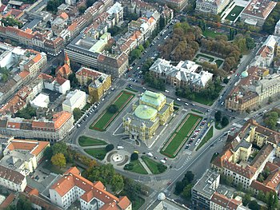
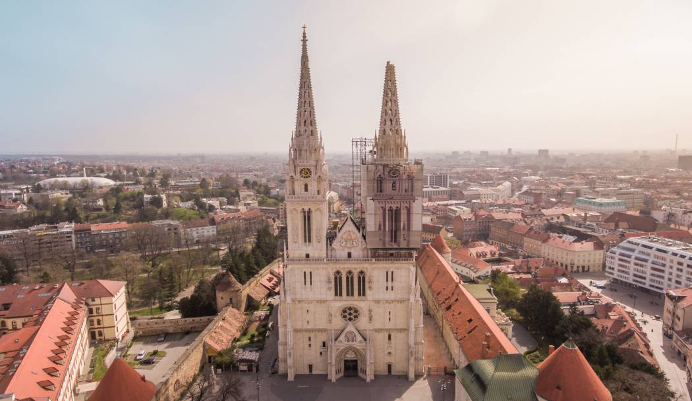
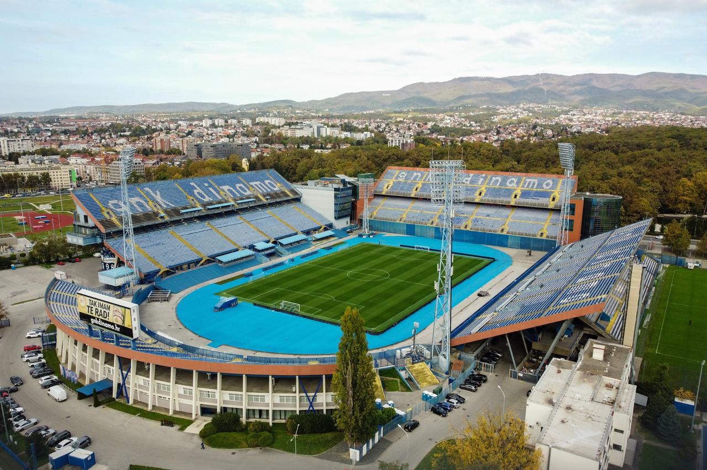
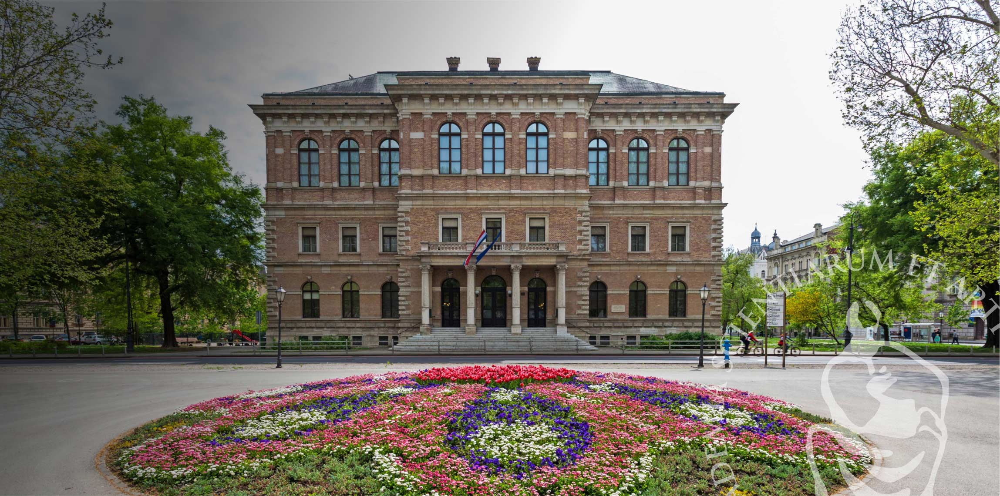

#  HTML slike

---

#### [WEB stranica](https://joska.vercel.app/repozitorij/3.%20razred/SJWP/LV06%20-%20html/HTML%20slike.html)

---

### HTML slike.html
```html
<!DOCTYPE html>
<html lang="hr">

<head>
    <meta charset="UTF-8">
    <meta name="viewport" content="width=device-width, initial-scale=1.0">
    <title>Značajni Lokaliteti Grada Zagreba</title>
    <style>
        body {
            font-family: 'Segoe UI';
            background: #cee2ff;
            color: #2d3436;
            margin: 0;
            padding: 25px 0;
        }

        h1 {
            font-size: 2.4em;
            margin-bottom: 40px;
            color: #2b6cb0;
            text-align: center;
            font-weight: 400;
        }

        p {
            max-width: 900px;
            line-height: 1.8;
            margin: 0 auto 50px auto;
            color: #4a5568;
            text-align: justify;
            background: white;
            padding: 25px;
            border-radius: 8px;
            box-shadow: 0 2px 4px rgba(0, 0, 0, 0.05);
        }

        .container {
            max-width: 800px;
            margin: 0 auto;
            padding: 0 20px;
        }

        .location-card {
            text-decoration: none;
            background: white;
            padding: 0;
            color: #2d3436;
            text-align: center;
            border-radius: 8px;
            border: 1px solid #e2e8f0;
            overflow: hidden;
            transition: transform 0.3s ease, box-shadow 0.3s ease;
            display: flex;
            flex-direction: column;
        }

        .location-card:hover {
            transform: translateY(-5px);
            box-shadow: 0 4px 12px rgba(0, 0, 0, 0.1);
        }

        .location-image {
            width: 100%;
            height: 200px;
            object-fit: cover;
            display: block;
        }

        .location-title {
            padding: 15px;
            margin: 0;
            font-weight: 500;
            background: white;
        }

        .grid-container {
            display: grid;
            grid-template-columns: repeat(auto-fit, minmax(250px, 1fr));
            gap: 25px;
            margin-top: 30px;
        }

        @media (max-width: 600px) {
            h1 {
                font-size: 2em;
            }

            .grid-container {
                grid-template-columns: 1fr;
            }
        }
    </style>
</head>

<body>
    <div class="container">
        <h1>
            Značajni Lokaliteti Grada Zagreba
        </h1>

        <p>
            Kao glavni i najveći (po broj stanovnika) grad Republike Hrvatske, Zagreb je njeno kulturno, znanstveno,
            gospodarsko i upravno središte, stoga ne čudi što u njemu možemo pronaći puno
            značajnih lokaliteta. U nastavku su navedeni neki koje možete posjetiti.
        </p>
        <div class="grid-container">
            <a href="https://hr.wikipedia.org/wiki/Trg_Republike_Hrvatske_(Zagreb)" target="_blank"
                class="location-card">
                
                <h3 class="location-title">Trg Republike Hrvatske</h3>
            </a>

            <a href="https://mimara.hr/Info" target="_blank" class="location-card">
                
                <h3 class="location-title">Muzej Mimara</h3>
            </a>

            <a href="https://katedrala.hr/" target="_blank" class="location-card">
                
                <h3 class="location-title">Zagrebačka katedrala</h3>
            </a>

            <a href="https://park-maksimir.hr/" target="_blank" class="location-card">
                
                <h3 class="location-title">Park Maksimir</h3>
            </a>

            <a href="https://gnkdinamo.hr/hr/Club/Stadium" target="_blank" class="location-card">
                
                <h3 class="location-title">Stadion Maksimir</h3>
            </a>

            <a href="https://www.info.hazu.hr/" target="_blank" class="location-card">
                
                <h3 class="location-title">HAZU</h3>
            </a>
        </div>
    </div>
</body>
</html>
```