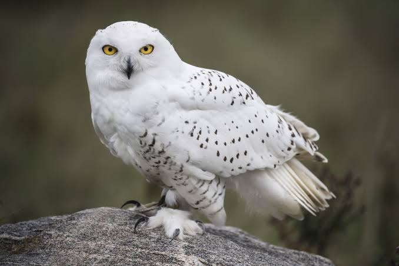
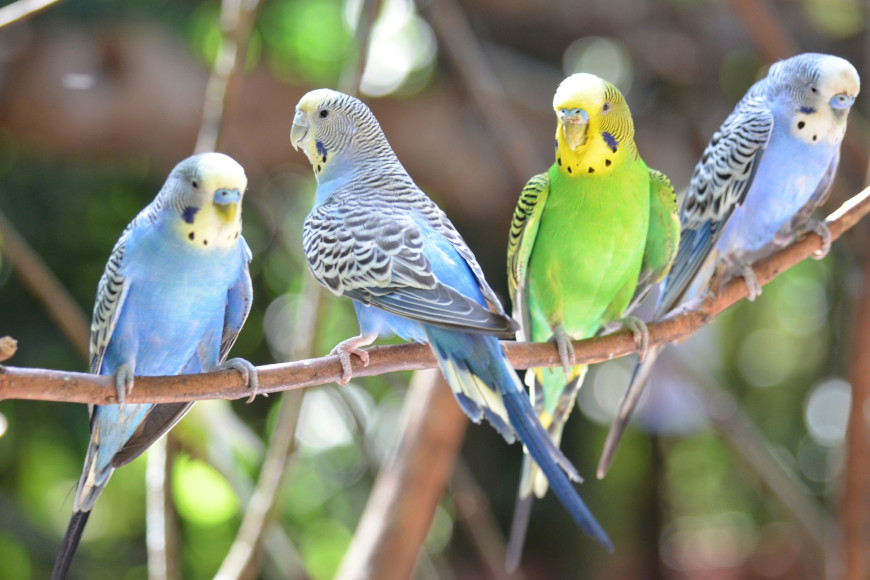
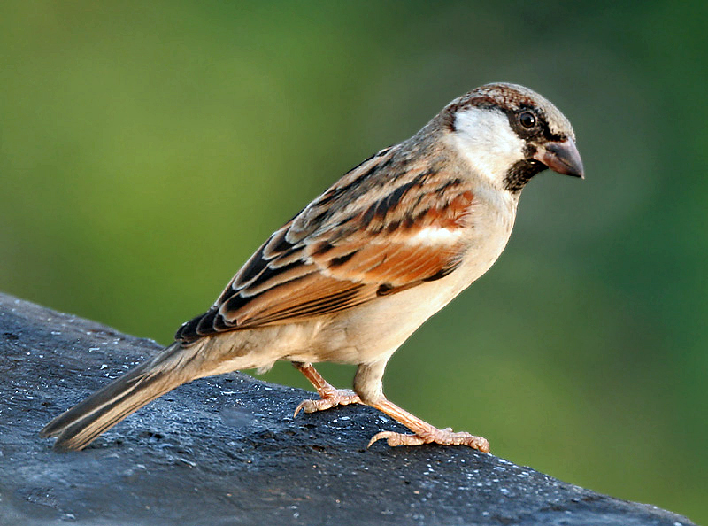

# Izrada mrežne stranice - A

---

#### [WEB stranica](https://joska.vercel.app/repozitorij/3.%20razred/SJWP/LV10%20-%20html/Izrada%20mrežne%20stranice%20-%20A.html)
---

### Izrada mrežne stranice - A.html
```html
<!DOCTYPE html>
<html lang="hr">

<head>
    <meta charset="UTF-8">
    <meta name="viewport" content="width=device-width, initial-scale=1.0">
    <title>Stranica o pticama</title>
    <style>
        body {
            font-family: system-ui, -apple-system, sans-serif;
            max-width: 1200px;
            margin: 0 auto;
            background-color: #eff9fb;
        }

        ::-webkit-scrollbar {
            width: 10px;
        }

        ::-webkit-scrollbar-track {
            background: transparent;
        }

        ::-webkit-scrollbar-thumb {
            background: #6B4DE6;
        }

        ::-webkit-scrollbar-thumb:hover {
            background: #5b36ee;
        }

        .nav {
            background-color: white;
            text-align: center;
            padding: 25px;
            border-radius: 5px;
            margin-bottom: 25px;
            box-shadow: 0 1px 5px rgba(0, 0, 0, 0.2);
        }

        .nav a {
            margin: 0 5px;
            color: #6B4DE6;
            padding: 10px 15px;
            border-radius: 2.5px;

            font-weight: bold;
            text-decoration: none;

            transition: all 0.5s ease;
        }

        .nav a:hover {
            background-color: #6B4DE6;
            color: white;
        }

        section {
            background-color: white;
            padding: 20px;
            margin-bottom: 30px;
            border-radius: 5px;
            box-shadow: 0 1px 5px rgba(0, 0, 0, 0.2);
        }

        h1 {
            text-align: center;
            color: #6B4DE6;
        }

        h2 {
            color: #6B4DE6;
            padding: 10px 0 10px 5px;
            border-left: 5px solid;
            margin-bottom: 20px;
        }

        .bird-content {
            display: flex;
            flex-direction: column;
            align-items: center;
            gap: 15px;
        }

        .bird-intro {
            width: 60%;
            text-align: justify;
            line-height: 1.5;
        }

        img {
            width: 60%;
            filter: grayscale(100%);
            border-radius: 5px;
        }

        .img-caption {
            text-align: center;
            font-weight: bold;
            color: #6B4DE6;
        }

        video {
            width: 60%;
            height: auto;
            border-radius: 5px;
        }

        audio {
            margin: 20px 0;
        }

        .youtube-link {
            margin: 20px 0;
            text-align: center;
        }

        .youtube-link a {
            color: #6B4DE6;

            padding: 10px 15px;
            border: 1px solid;
            border-radius: 5px;

            text-decoration: none;

            transition: all 0.5s ease;
        }

        .youtube-link a:hover {
            background-color: #6B4DE6;
            color: white;
        }

        form {
            background-color: white;
            padding: 20px;
            margin-bottom: 15px;
            border-radius: 5px;
            box-shadow: 0 1px 5px rgba(0, 0, 0, 0.2);
        }


        label {
            display: block;
            margin-bottom: 5px;
        }

        input[type="text"],
        input[type="email"] {
            width: 300px;
            padding: 10px;
            border: 1px solid #e6e6fa;
            border-radius: 5px;
            margin-bottom: 10px;
        }

        select {
            width: 320px;
            padding: 10px;
            border: 1px solid #e6e6fa;
            border-radius: 5px;
            margin-bottom: 10px;
        }

        input[type="submit"] {
            width: 320px;

            background-color: #6B4DE6;
            color: white;
            padding: 10px 20px;
            border: none;
            border-radius: 5px;
            cursor: pointer;

            transition: all 0.5s ease;
        }

        input[type="submit"]:hover {
            background-color: #5a3ec4;
        }

        .required:after {
            content: "*";
            color: #ef4444;
            margin-left: 0.25rem;
        }

        @media (max-width: 768px) {
            body {
                font-size: 10px;
            }

            img {
                width: 80%;
            }

            video {
                width: 80%;
            }

            audio {
                width: 80%;
            }

            .bird-intro {
                width: 80%;
            }

        }
    </style>
</head>

<body>
    <h1>Stranica o pticama</h1>

    <nav class="nav">
        <a href="#sova">Bijela Sova</a>
        <a href="#papiga">Papiga Tigrica</a>
        <a href="#ptica-pjevac">Vrabac</a>
    </nav>

    <section id="sova">
        <div class="bird-content">
            <p class="bird-intro">
                Bijela sova je velika ptica grabljivica duljine 52-71 cm, raspona krila do 1,5 m i težine 1,6-3 kg.
                Nastanjuje tundre i hladne regije Arktika, gdje se savršeno uklapa u snježni okoliš zahvaljujući bijelom
                perju. Hrani se sitnim sisavcima poput leminga, pticama i drugim manjim životinjama. Aktivna je i danju
                i noću, a poznata je po tihoj i preciznoj lovini.
            </p>

            
            <div class="img-caption">Bijela sova</div>

            <audio controls>
                <source src="zvukovi/sova.mp3" type="audio/mp3">
                Vaš preglednik ne podržava audio element.
            </audio>

            <video controls>
                <source src="video/sova.mp4" type="video/mp4">
                Vaš preglednik ne podržava video element.
            </video>

            <div class="youtube-link">
                <a href="https://youtu.be/m2OkWdkAV-M?si=_cOx0uUrRjcWCL3I" target="_blank">
                    YouTube
                </a>
            </div>
            <a href="#">Povratak</a>
        </div>
    </section>

    <section id="papiga">
        <div class="bird-content">
            <p class="bird-intro">
                Papiga tigrica, poznata i kao valoviti papagaj, mala je ptica duljine 18-20 cm i težine oko 30-40 g.
                Podrijetlom iz australskih savana, gdje obitava u jatima. Ima upečatljivu zeleno-žutu boju s crnim
                uzorcima na leđima, dok su u uzgoju dostupne i mnoge druge boje. Hrani se sjemenkama, voćem i povremeno
                biljkama. Vrlo je društvena i česta kao kućni ljubimac.
            </p>

            
            <div class="img-caption">Papige tigrice</div>

            <audio controls>
                <source src="zvukovi/papiga.mp3" type="audio/mp3">
                Vaš preglednik ne podržava audio element.
            </audio>

            <video controls>
                <source src="video/papiga.mp4" type="video/mp4">
                Vaš preglednik ne podržava video element.
            </video>

            <div class="youtube-link">
                <a href="https://youtu.be/G1XgHwpJceU?feature=shared" target="_blank">
                    YouTube
                </a>
            </div>
            <a href="#">Povratak</a>
        </div>
    </section>

    <section id="ptica-pjevac">
        <div class="bird-content">
            <p class="bird-intro">
                Vrabac je mala ptica duljine 14-16 cm i težine oko 24-40 g. Pripada obitelji vrabaca (Passeridae), a
                prepoznatljiv je po smeđim perima s tamnim uzorcima te svjetlijem trbuhu. Naseljava gradska i ruralna
                područja diljem svijeta, često u blizini ljudi. Hrani se sjemenkama, kukcima i ostacima hrane. Vrlo je
                prilagodljiv i društven, često se viđa u jatima.
            </p>

            
            <div class="img-caption">Vrabac</div>

            <audio controls>
                <source src="zvukovi/vrabac.mp3" type="audio/mp3">
                Vaš preglednik ne podržava audio element.
            </audio>

            <video controls>
                <source src="video/vrabac.mp4" type="video/mp4">
                Vaš preglednik ne podržava video element.
            </video>

            <div class="youtube-link">
                <a href="https://youtu.be/DWzGOIqbIRk?si=EL-zyZYCnHxu7WOB" target="_blank">
                    YouTube
                </a>
            </div>
            <a href="#">Povratak</a>
        </div>
    </section>

    <form>
        <h2>Obrazac</h2>
        <div class="form-group">
            <label for="ime" class="required">Ime</label>
            <input type="text" id="ime" name="ime" required placeholder="Unesite vaše ime">
        </div>

        <div class="form-group">
            <label for="email" class="required">E-mail adresa</label>
            <input type="email" id="email" name="email" required placeholder="ime.prezime@example.com">
        </div>

        <div class="form-group">
            <label for="ptica">O kojoj ptici želite saznati više:</label>
            <select id="ptica" name="ptica">
                <option value="sova">Bijela sova</option>
                <option value="papiga">Papiga Tigrica</option>
                <option value="ptica-pjevac">Vrabac</option>
            </select>
        </div>

        <div class="form-group">
            <label for="materijal">Vrsta materijala:</label>
            <select id="materijal" name="materijal">
                <option value="tekst">Tekst</option>
                <option value="slike">Slike</option>
                <option value="zvuk">Zvuk</option>
                <option value="video">Video</option>
            </select>
        </div>

        <input type="submit" value="Pošalji upit">
    </form>
</body>

</html>
```