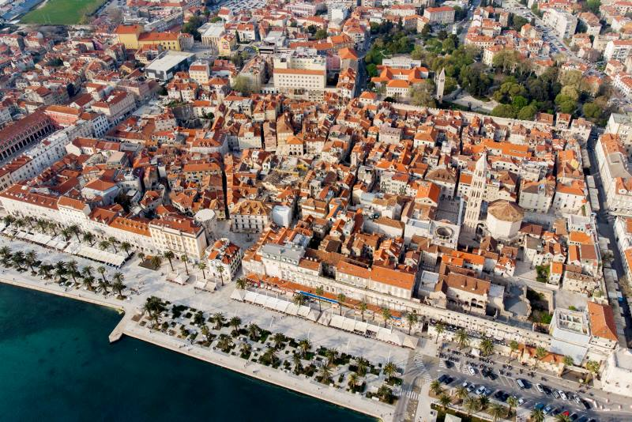

# LV11 - Izrada mrežne stranice

---

#### [Izrada mrežne stranice - A.html](https://joska.vercel.app/repo%20-%20sadr%C5%BEaj/3.%20razred/SJWP/LV11%20-%20html/Izrada%20mrežne%20stranice%20-%20A.html)
---


```html
<!DOCTYPE html>
<html lang="hr">

<head>
    <meta charset="UTF-8">
    <meta name="viewport" content="width=device-width, initial-scale=1">
    <meta name="description" content="Hrvatski gradovi - Zagreb, Split, Zadar">
    <link rel="stylesheet" href="Izrada mrežne stranice - A.css">
    <title>Gradovi Hrvatske</title>
</head>

<body>
    <header>
        <h1>Gradovi Hrvatske</h1>
    </header>

    <div class="content-wrapper">
        <nav role="navigation" aria-label="Glavni izbornik">
            <ul>
                <li><a href="#zagreb">Zagreb</a></li>
                <li><a href="#split">Split</a></li>
                <li><a href="#zadar">Zadar</a></li>
            </ul>
        </nav>

        <main class="article-container">
            <article id="zagreb">
                <h2>Zagreb</h2>
                <div class="article-content">
                    <div class="article-text">
                        <p>Zagreb je glavni grad Republike Hrvatske i najveći grad u zemlji. Smješten u kontinentalnoj
                            središnjoj Hrvatskoj, grad predstavlja kulturno, znanstveno, gospodarsko i administrativno
                            središte
                            Hrvatske.</p>
                        <p>Grad se posebno ponosi svojim povijesnim Gornjim gradom, gdje se nalaze znamenita crkva Sv.
                            Marka,
                            Hrvatski sabor i Banski dvori. Donji grad krasi niz parkova i trgova poznatih kao
                            "Lenucijeva
                            potkova".</p>
                        <section class="external-links">
                            <h3>Korisne poveznice</h3>
                            <ul>
                                <li><a href="https://www.zagreb.hr" target="_blank" rel="noopener">Službena stranica
                                        grada Zagreba</a></li>
                                <li><a href="https://www.infozagreb.hr" target="_blank" rel="noopener">Turistička
                                        zajednica grada Zagreba</a></li>
                            </ul>
                        </section>
                    </div>
                    
                </div>
            </article>

            <article id="split">
                <h2>Split</h2>
                <div class="article-content">
                    <div class="article-text">
                        <p>Split je drugi najveći grad u Hrvatskoj i najveći grad na dalmatinskoj obali. Središte grada
                            čini
                            Dioklecijanova palača, spomenik pod zaštitom UNESCO-a, izgrađena u 4. stoljeću za rimskog
                            cara
                            Dioklecijana.</p>
                        <p>Danas je Split živahan mediteranski grad koji spaja povijesnu baštinu s modernim načinom
                            života.
                            Poznat je po svojim plažama, posebice Bačvicama, živopisnoj tržnici i rivi.</p>
                        <section class="external-links">
                            <h3>Korisne poveznice</h3>
                            <ul>
                                <li><a href="https://www.split.hr" target="_blank" rel="noopener">Službena stranica
                                        grada Splita</a></li>
                                <li><a href="https://visitsplit.com" target="_blank" rel="noopener">Turistička zajednica
                                        grada Splita</a></li>
                            </ul>
                        </section>
                    </div>
                    
                </div>
            </article>

            <article id="zadar">
                <h2>Zadar</h2>
                <div class="article-content">
                    <div class="article-text">
                        <p>Zadar je grad iznimne povijesne važnosti i jedan od najstarijih kontinuirano naseljenih
                            gradova u
                            Hrvatskoj. Smješten na obali Jadranskog mora, grad je poznat po jedinstvenim morskim
                            orguljama i
                            instalaciji Pozdrav Suncu.</p>
                        <p>Povijesna jezgra grada nalazi se na poluotoku i dom je brojnim rimskim i srednjovjekovnim
                            građevinama, uključujući crkvu sv. Donata iz 9. stoljeća.</p>
                        <section class="external-links">
                            <h3>Korisne poveznice</h3>
                            <ul>
                                <li><a href="https://www.zadar.hr" target="_blank" rel="noopener">Službena stranica
                                        grada Zadra</a></li>
                                <li><a href="https://www.zadar.travel" target="_blank" rel="noopener">Turistička
                                        zajednica grada Zadra</a></li>
                            </ul>
                        </section>
                    </div>
                    
                </div>
            </article>
        </main>
    </div>

    <footer>
        <div class="footer-content">
            <section class="footer-section">
                <h3>O projektu</h3>
                <p>Projekt "Gradovi Hrvatske" predstavlja neke od najznačajnijih hrvatskih gradova/destinacija.</p>
            </section>
        </div>
    </footer>
</body>
```

```css
* {
    margin: 0;
    padding: 0;
    box-sizing: border-box;
    font-family: system-ui, -apple-system, sans-serif;
}

:root {
    --primary-color: #2B4865;
    --accent-color: #256D85;
    --background-color: #F5F5F5;
    --text-color: #1e293b;
    --header-height: 80px;
    --footer-height: 200px;
}

body {
    background-color: var(--background-color);
    color: var(--text-color);
    line-height: 1.6;
    display: flex;
    flex-direction: column;
}

header {
    background: linear-gradient(135deg, var(--accent-color), var(--text-color), var(--accent-color));
    color: white;
    height: var(--header-height);

    position: fixed;
    width: 100%;
    top: 0;

    z-index: 1;

    display: flex;
    align-items: center;
    justify-content: center;
}

header h1 {
    font-size: 2.5rem;
    font-weight: bold;
}

.content-wrapper {
    margin-top: var(--header-height);
}

nav {
    background-color: white;
    width: 250px;
    padding: 2rem;
    position: fixed;
    height: calc(100vh - var(--header-height));
    box-shadow: 2px 0 10px rgba(0, 0, 0, 0.1);
}

nav ul {
    list-style: none;
}

nav ul li {
    margin-bottom: 1rem;
}

nav a {
    text-decoration: none;
    color: var(--text-color);
    font-size: 1.1rem;
    padding: 0.5rem 1rem;
    display: block;
    border-radius: 8px;
    transition: all 0.3s ease;
}

nav a:hover {
    background-color: var(--accent-color);
    color: white;
    transform: translateX(5px);
}

.article-container {
    margin-left: 250px;
    padding: 2rem;
    width: calc(100% - 250px);
}

article {
    background-color: white;
    border-radius: 12px;
    padding: 2rem;
    margin-bottom: 2rem;
    box-shadow: 0 4px 6px rgba(0, 0, 0, 0.1);
    transition: transform 0.3s ease;
}

article:hover {
    transform: translateY(-5px);
}

article h2 {
    color: var(--primary-color);
    font-size: 2rem;
    margin-bottom: 1rem;
    border-bottom: 3px solid var(--accent-color);
    padding-bottom: 0.5rem;
}

.article-content {
    display: grid;
    grid-template-columns: 1fr 1fr;
    gap: 2rem;
    align-items: start;
}

.article-text {
    display: flex;
    flex-direction: column;
    gap: 1rem;
}

article p {
    margin-bottom: 1rem;
    font-size: 1.1rem;
    color: var(--text-color);
}

.city-image {
    width: 100%;
    height: 400px;
    object-fit: cover;
    border-radius: 8px;
    box-shadow: 0 4px 6px rgba(0, 0, 0, 0.1);
}

.external-links {
    margin-top: 1rem;
    padding: 1rem;
    background-color: #f8fafc;
}

.external-links h3 {
    color: var(--primary-color);
    margin-bottom: 0.5rem;
}

.external-links a {
    color: var(--accent-color);
    text-decoration: none;
    display: inline-block;
    margin: 0.25rem 0;
    transition: color 0.3s ease;
}

.external-links a:hover {
    color: var(--primary-color);
    text-decoration: underline;
}

footer {
    background-color: var(--primary-color);
    color: white;
    padding: 2rem;
    height: var(--footer-height);
    margin-top: auto;
}

.footer-content {
    max-width: 1200px;
    margin: 0 auto;
    display: grid;
    grid-template-columns: repeat(3, 1fr);
    gap: 2rem;
}

.footer-section h3 {
    color: #8BB8E8;
    margin-bottom: 1rem;
    font-size: 1.2rem;
}

.footer-section ul {
    list-style: none;
}


@media (max-width: 768px) {
    nav {
        width: 100%;
        height: auto;
        position: relative;
        padding: 1rem;
    }

    .content-wrapper {
        flex-direction: column;
        margin-bottom: 0;
    }

    .article-container {
        margin-left: 0;
        width: 100%;
        padding: 1rem;
    }

    .article-content {
        grid-template-columns: 1fr;
    }

    .footer-content {
        grid-template-columns: 1fr;
        gap: 1rem;
    }

    footer {
        height: auto;
    }
}
```