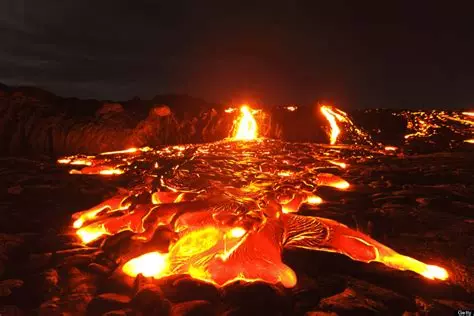

# LV11 - 1C, 2B, 2D, 3F

---
#### [WEB stranica](https://joska.vercel.app/repozitorij/3.%20razred/SJWP/LV11%20-%20html/LV11%20-%201C,%202B,%202D,%203F.html)
---

### LV11 - 1C, 2B, 2D, 3F.html
```html
<!DOCTYPE html>
<html lang="en">

<head>
    <meta charset="UTF-8">
    <meta name="viewport" content="width=device-width, initial-scale=1.0">
    <style>
        * {
            margin: 0;
            padding: 0;
            box-sizing: border-box;
        }

        body {
            font-family: system-ui, -apple-system, sans-serif;
        }

        .container {
            display: flex;
            flex-direction: column;
            align-items: center;
            justify-content: center;
            min-height: 100vh;
            padding: 20px;
            margin-bottom: 20px;
        }

        section {
            max-width: 45%;
            margin: 30px 0;
            display: flex;
            flex-direction: column;
            justify-content: center;
            padding-top: 20px;
        }

        article {
            text-align: justify;
            padding: 15px;
            width: 100%;
        }

        h3 {
            font-weight: 500;
            margin-bottom: 15px;
        }

        nav {
            position: fixed;
            display: flex;
            flex-direction: column;
            padding: 10px;
        }

        nav a {
            padding: 15px;
            text-decoration: none;
            margin-bottom: 10px;
            border-radius: 5px;
            transition: background-color 0.3s ease;
        }

        nav a:hover {
            background-color: #f0f0f0;
        }

        img {
            width: 400px;
            border-radius: 5px;
        }

        figcaption {
            text-align: center;
            font-style: italic;
            margin-top: 5px;
        }

        footer {
            text-align: center;
            padding: 20px;
            font-weight: bold;
            margin-top: auto;
        }
    </style>
    <title>LV11 - 1C, 2B, 2D, 3F</title>
</head>

<body>
    <nav>
        <a href="https://www.wikipedia.org/" target="_blank">Wikipedia</a>
        <a href="https://www.colorhexa.com/" target="_blank">Color Hexa</a>
        <a href="https://www.colourlovers.com/" target="_blank">Colour Lovers</a>
    </nav>

    <div class="container">
        <section>
            <h1>Tople boje</h1>
            <article>
                <h3>Vatra i Sunce</h3>
                <p>Tople boje su one koje nas podsjećaju na elemente poput vatre i Sunca. Ove boje na nas djeluju toplo
                    i energično, stvarajući osjećaj intime i udobnosti.</p>
            </article>
            <article>
                <h3>Osjećaji</h3>
                <p>Tople boje izazivaju osjećaj energije, privlačnosti, ugode, strasti i bliskosti. One mogu
                    stimulirati, podići raspoloženje i stvoriti dinamičnu atmosferu.</p>
            </article>
            <article>
                <h3>Boje</h3>
                <p>Crvena, narančasta i žuta su tipične tople boje. Osim što utječu na naše raspoloženje, ove boje mogu
                    promijeniti i percepciju prostora. Toplije boje mogu učiniti interijer udobnijim, no također mogu
                    stvoriti dojam manjeg prostora.</p>
            </article>
        </section>

        <figure>
            
            <figcaption>Tople boje</figcaption>
        </figure>

        <section>
            <h1>Hladne boje</h1>
            <article>
                <h3>Voda i Nebo</h3>
                <p>Hladne boje podsjećaju na elemente prirode poput vode i neba, stvarajući smirujući, opuštajući i
                    osvježavajući dojam. Ove boje često izazivaju osjećaj mira i fokusa.</p>
            </article>
            <article>
                <h3>Boje</h3>
                <p>Plava, zelena i ljubičasta su tipične hladne boje. Osim što stvaraju iluziju većeg prostora, ove boje
                    mogu učiniti prostor previše hladnim ili sterilnim ako nisu pravilno uravnotežene.</p>
            </article>
        </section>
        <figure>
            
            <figcaption>Hladne boje</figcaption>
        </figure>
    </div>

    <footer>
        <p>Autor: Niko Josipović, III-b</p>
    </footer>
</body>

</html>
```
