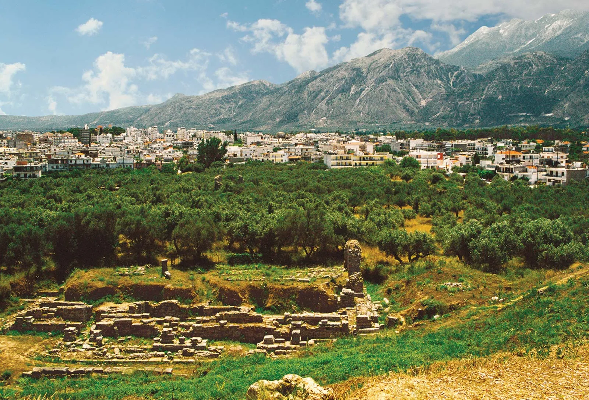
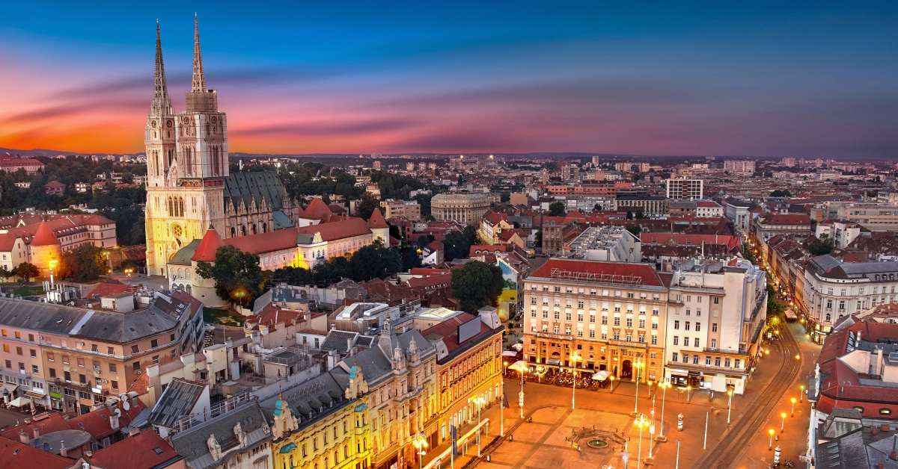
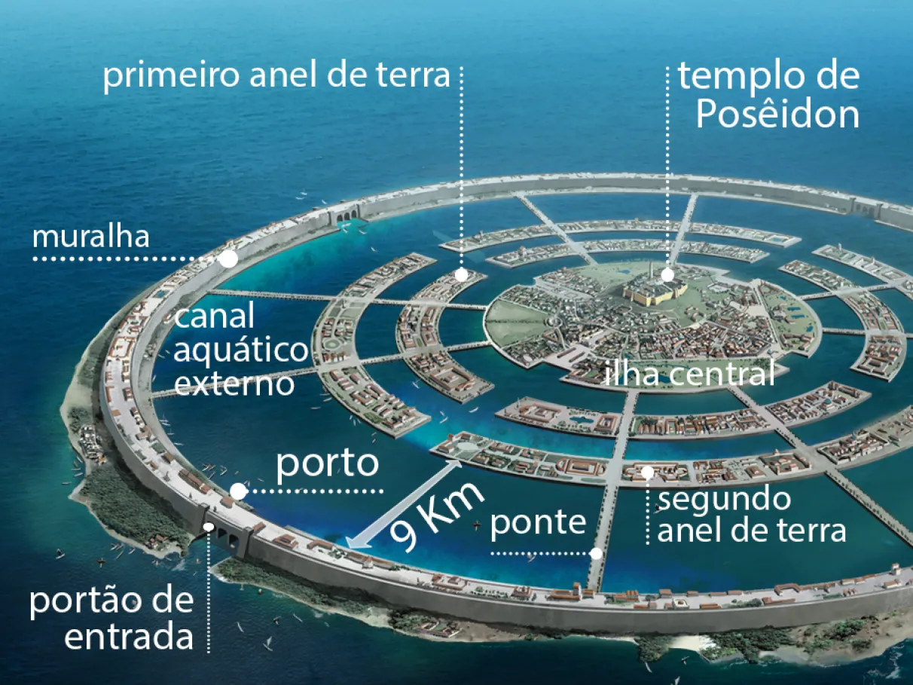

# LV18 - Praktična vježba (1)

---
#### [WEB stranica](https://joska.vercel.app/repozitorij/3.%20razred/SJWP/LV18%20-%20css/index(1).html)
---

### index(1).html
```html
<!DOCTYPE html>
<html lang="hr">

<head>
    <meta charset="UTF-8">
    <meta name="viewport" content="width=device-width, initial-scale=1.0">
    <link rel="stylesheet" href="styles(1).css">
    <title>Putovanja</title>
</head>

<body>
    <table>
        <tr>
            <th>Destinacija</th>
            <th>Trajanje</th>
            <th>Vrsta smještaja</th>
            <th>Obroci</th>
            <th>Cijena</th>
            <th>Prijevoz</th>
            <th>Slike</th>
            <th>Poveznice</th>
        </tr>
        <tr>
            <td>Sparta</td>
            <td>7 dana</td>
            <td>Hotel</td>
            <td>Puni pansion</td>
            <td>4000$</td>
            <td>Avion</td>
            <td></td>
            <td><a href="https://www.visitgreece.gr/mainland/peloponnese/sparta/">Više...</a></td>
        </tr>
        <tr>
            <td>Zagreb</td>
            <td>3 dana</td>
            <td>Apartman</td>
            <td>Samostalno</td>
            <td>1500$</td>
            <td>Vlak</td>
            <td></td>
            <td><a href="https://www.infozagreb.hr/hr">Više...</a></td>
        </tr>
        <tr>
            <td>Atlantida</td>
            <td>5 dana</td>
            <td>Kupola</td>
            <td>Bez obroka</td>
            <td>100000$</td>
            <td>Podmornica</td>
            <td></td>
            <td><a href="https://hr.wikipedia.org/wiki/Atlantida">Više...</a></td>
        </tr>
    </table>
</body>

</html>
```

### styles(1).css
```css
body {
    background-color: #f4f7fc;
    font-family: Arial, sans-serif;
}

table {
    position: absolute;
    top: 40%;
    left: 50%;
    transform: translate(-50%, -50%);
    width: 65%;
    height: 50%;
    border-collapse: collapse;
    box-shadow: 0 4px 10px rgba(0, 0, 0, 0.1);
}

th,
td {
    padding: 12px;
    text-align: center;
    font-size: 15px;
}

th {
    background-color: #0056b3;
    color: white;
}

td {
    border-bottom: 1px solid #e0e0e0;
}

td:nth-child(even) {
    font-weight: bold;
}


tr {
    background-color: white;
    transition: all 0.5s ease;
}

tr:hover {
    background-color: #e3f2fd;
}

img {
    width: 80px;
    height: 80px;
    border-radius: 5px;
    object-fit: cover;
}

@media screen and (max-width: 768px) {
    table {
        width: 90%;
    }

    th,
    td {
        font-size: 13px;
        padding: 8px;
    }
}
```